# ServiceNow Help Desk Simulation

## Overview

Configured a ServiceNow ITSM Personal Developer Instance (Zurich release) to simulate a corporate help desk environment. This project covers the full incident management lifecycle: SLA configuration, ticket creation and triage, systematic troubleshooting with documented work notes, resolution, and Knowledge Base development for recurring issues.

## Tools Used

- **ServiceNow (Zurich release)** — ITSM platform used to manage incidents, SLAs, and Knowledge Base articles
- **Incident Management** — Created, triaged, and resolved 10 realistic support tickets across multiple categories
- **SLA Management** — Priority-based response and resolution targets for incident handling
- **Knowledge Base** — Authored 3 technical articles to standardize resolution procedures for common issues

---

## What I Did

### 1. SLA Configuration

The instance came pre-configured with SLA definitions tied to each incident priority level. Each priority has both a **response time** (how quickly the ticket must be acknowledged) and a **resolution time** (how quickly the issue must be fully resolved). This ensures that critical incidents affecting multiple users are addressed before lower-priority requests.

| Priority | Response Time | Resolution Time |
|----------|--------------|-----------------|
| Priority 1 - Critical | 15 Minutes | 1 Hour |
| Priority 2 - High | 1 Hour | 8 Hours |
| Priority 3 - Medium | 4 Hours | 1 Day |
| Priority 4 - Low | 8 Hours | 2 Days |

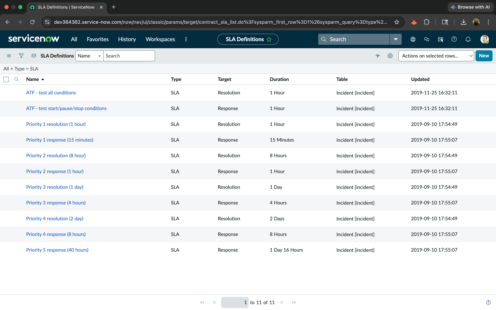
*SLA Definitions filtered by type, showing response and resolution targets for each priority level.*

---

### 2. Incident Creation & Triage

Created 10 realistic incidents covering a range of common help desk scenarios. Each ticket was categorized, assigned a priority based on impact and urgency, and routed to the Service Desk assignment group. Below is an example of the incident creation form for a password lockout ticket — the first ticket I created in this lab.

**Fields configured for each incident:**
- **Caller** — the user reporting the issue
- **Category** — the type of problem (Password Reset, Network, Hardware, Software, Inquiry/Help)
- **Channel** — how the user contacted support (Phone, Email, Self-Service)
- **Impact & Urgency** — used to auto-calculate Priority
- **Short Description** — one-line summary of the issue
- **Description** — full details of the problem as reported by the user

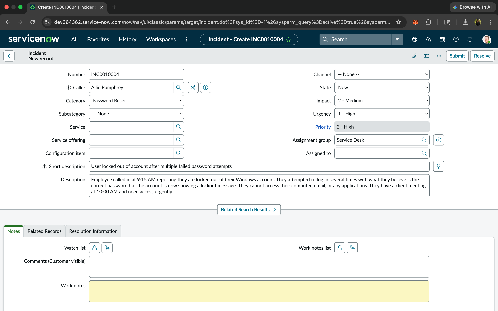
*Creating Incident INC0010004: User locked out after multiple failed password attempts. Category set to Password Reset, Impact 2 - Medium, Urgency 1 - High, auto-calculated Priority 2 - High.*

---

### 3. Troubleshooting & Resolution with Work Notes

For every ticket, I documented the full troubleshooting process using **work notes** — internal notes visible only to IT staff. Each ticket follows a consistent structure: initial assessment, troubleshooting steps taken, and final resolution with root cause identification.

Below are four highlighted tickets showing different types of incidents and troubleshooting approaches.

---

#### Ticket #1: User Locked Out of Account (Priority 2 - High)

A user was unable to log into their Windows account after multiple failed password attempts. Troubleshooting involved verifying the user's identity, locating the account in Active Directory, unlocking it, and resetting the password with a force-change on next logon.

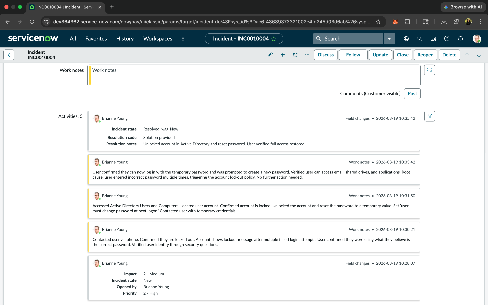
*Resolved incident showing three work notes: initial user contact and verification, Active Directory account unlock and password reset, and confirmation that the user regained full access. Resolution code: Solution provided.*

---

#### Ticket #4: Remote User Unable to Connect to VPN (Priority 2 - High)

A remote employee reported their VPN connection was timing out. After confirming their internet was functional and no changes had been made to their home network, I walked through standard troubleshooting steps (restart client, restart laptop, reconnect Wi-Fi). When those failed, I had the user try a secondary VPN endpoint, which connected successfully. The primary endpoint issue was escalated to Network Engineering.

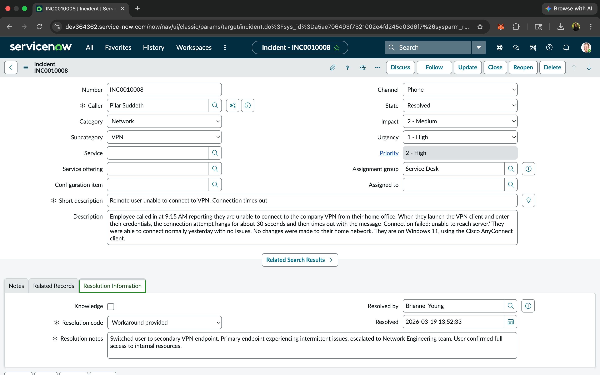
*Incident details showing category (Network), priority, and resolution information. Resolution code: Workaround provided — user switched to secondary VPN endpoint while primary endpoint issue was escalated.*

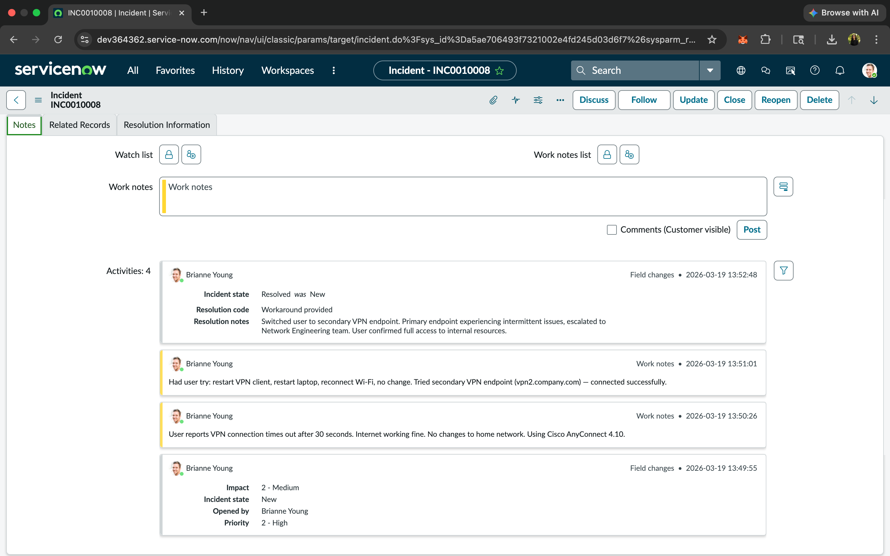
*Work notes documenting the systematic troubleshooting process: initial assessment, steps attempted, successful workaround, and escalation to Network Engineering.*

---

#### Ticket #5: Shared Printer Down — 15 Users Affected (Priority 1 - Critical)

Multiple users on the 3rd floor reported the shared printer was not responding. After checking the printer status remotely (showing offline), restarting the Print Spooler service, and pinging the printer IP with no response, I contacted the facilities team. They discovered the printer's power cable had been accidentally unplugged during overnight cleaning. After reconnecting power and restarting Print Spooler on affected workstations, printing was restored for all 15 users.

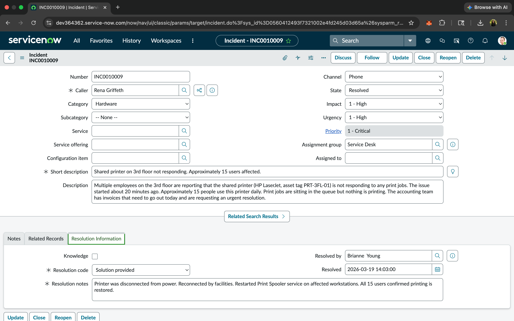
*Critical incident resolved: printer power cable was disconnected during cleaning. Coordinated with facilities team for physical reconnection.*

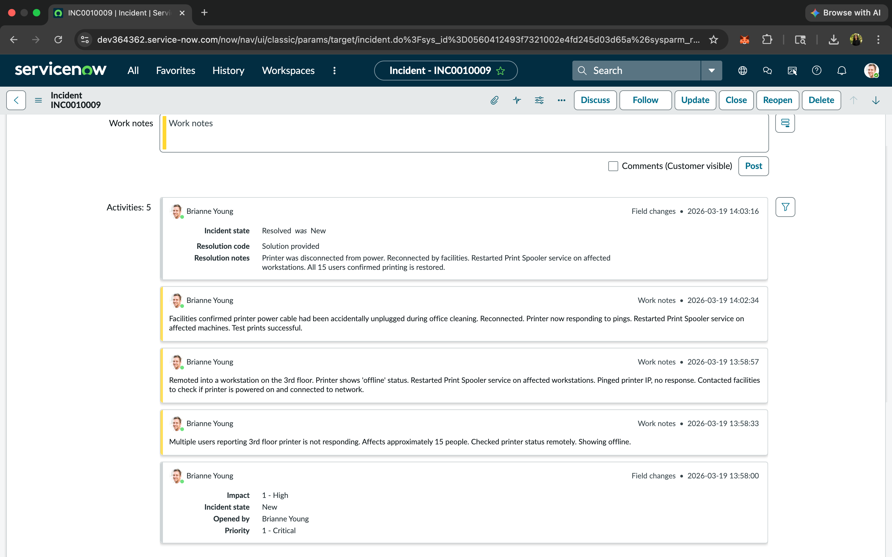
*Work notes showing the escalation path: remote diagnosis, Print Spooler restart attempt, network ping test, facilities coordination, and confirmation of resolution across all affected users.*

---

#### Ticket #10: Accounting Department Unable to Access Shared Drive — 12 Users Affected (Priority 1 - Critical)

The entire accounting department (12 users) reported they could not access \\FileServer01\Accounting with the error "network path not found." Other departments were unaffected. Investigation revealed the server was reachable via ping and other shares were accessible — only the Accounting share was missing. Root cause: the share had been inadvertently removed during overnight server maintenance. Re-sharing the folder with original NTFS and share permissions restored access for all users.

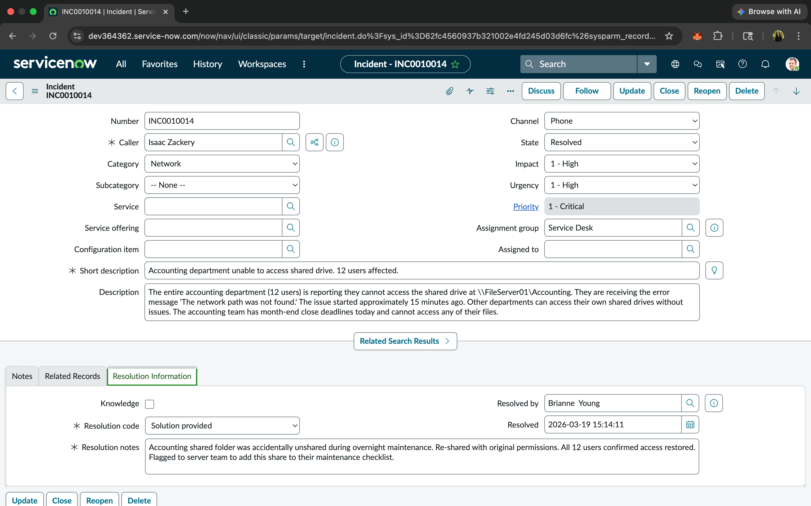
*Critical incident resolved: Accounting shared folder was accidentally unshared during maintenance. Re-shared with original permissions and flagged to server team for maintenance checklist update.*

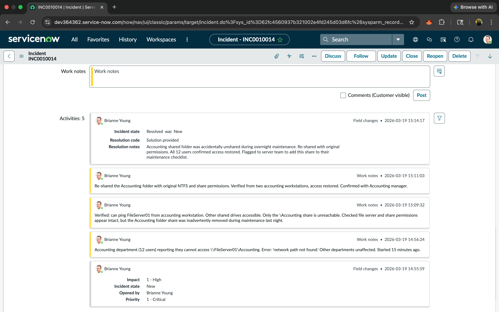
*Work notes documenting the diagnostic process: verified server connectivity, isolated the issue to the specific share, identified root cause, restored the share, and verified access from multiple workstations.*

---

### 4. All Resolved Incidents

All 10 incidents were created, triaged, documented with work notes, and resolved within a single session. The tickets cover a range of help desk scenarios including password lockouts, VPN failures, printer outages, new employee onboarding, employee offboarding, software installations, performance issues, Wi-Fi connectivity, and a department-wide shared drive outage.

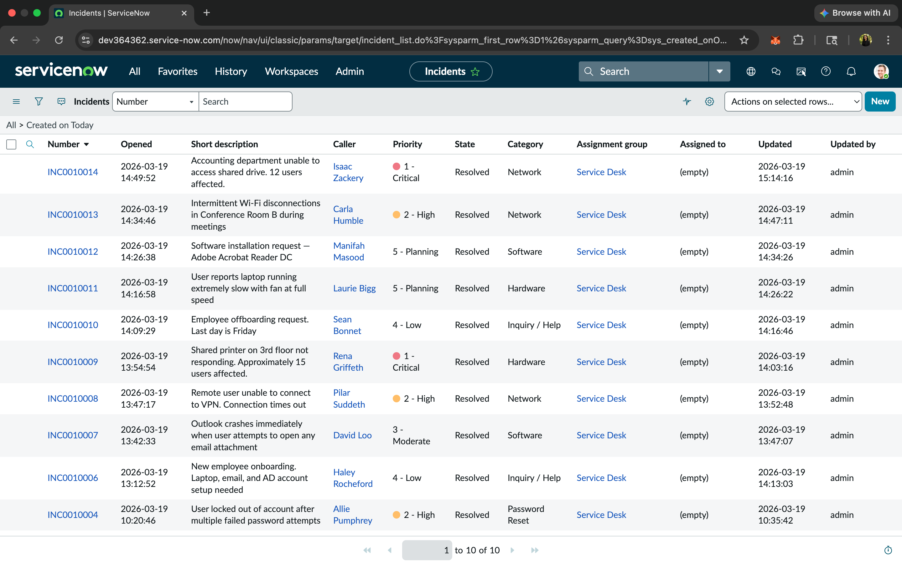
*Incident list filtered to show all 10 tickets created for this lab — all in Resolved state, with varying priority levels from Critical to Planning.*

---

### 5. Knowledge Base Development

After resolving the tickets, I authored three Knowledge Base articles to document resolution procedures for recurring issues. These articles provide step-by-step guides that any technician can follow, reducing resolution time and ensuring consistency across the team.

#### Articles Created:

**KB0010001 — How to Unlock a Locked Active Directory Account**
Covers the full process: locating the account in ADUC, unlocking it, resetting the password with force-change, and when to escalate to the security team for repeated lockouts.

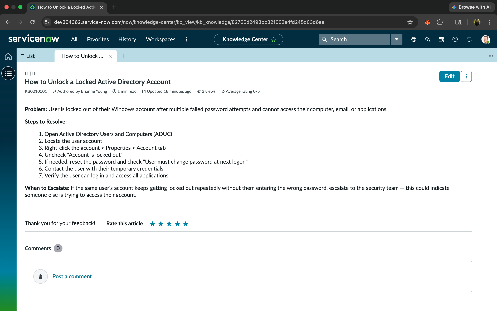
*Knowledge Base article with structured Problem, Steps to Resolve, and When to Escalate sections.*

**KB0010002 — VPN Troubleshooting Steps for Remote Workers**
Step-by-step diagnostic guide starting from internet verification through VPN client restart, secondary endpoint testing, and escalation criteria for server-level issues.

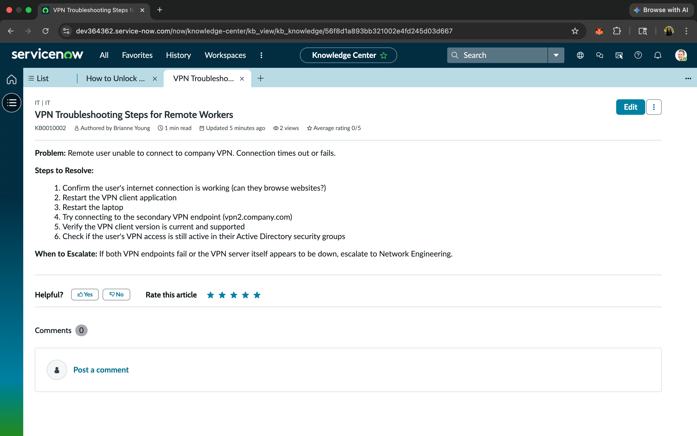
*VPN troubleshooting guide authored for the IT Knowledge Base.*

**KB0010003 — New Employee IT Onboarding Checklist**
Standard operating procedure for IT setup when a new employee joins: AD account creation, security group assignments, shared drive access, email configuration, and manager notification.

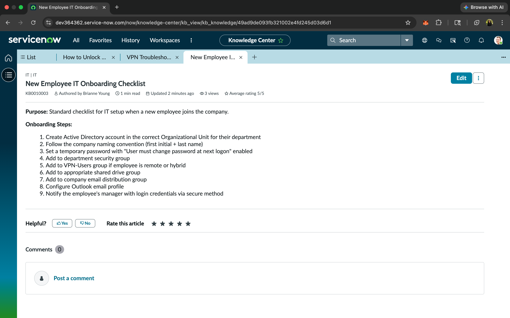
*Onboarding checklist covering the full account provisioning workflow from AD account creation through manager notification.*

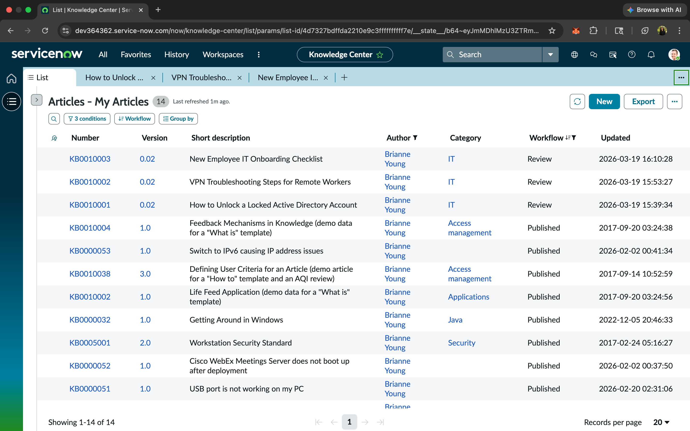
*Knowledge Base article list showing all three articles authored for this lab, filed under the IT category.*

---

## Key Takeaways

- **Incident Lifecycle Management** — Practiced the full ticket lifecycle from creation and triage through troubleshooting, resolution, and closure
- **Work Note Documentation** — Wrote detailed internal notes documenting troubleshooting logic, not just outcomes — creating an evidence trail for each incident
- **Priority-Based Triage** — Applied SLA-driven prioritization based on impact and urgency to ensure critical incidents are addressed first
- **Escalation Procedures** — Identified when issues required escalation to specialized teams (Network Engineering, Facilities) and documented handoff notes
- **Knowledge Base Development** — Created standardized resolution guides to reduce resolution time for recurring issues and improve team consistency
